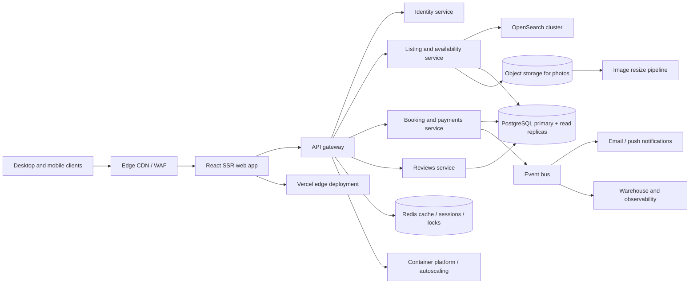

# Production Architecture

The frontend is served from an edge CDN with SSR for SEO and route-level caching. Stateless services scale horizontally behind an API gateway; PostgreSQL remains the source of truth for transactional booking state with read replicas for browsing. Redis handles short-lived availability reads and distributed booking locks. Search is independently scaled in OpenSearch, while original media lives in object storage and passes through an image resizing pipeline before CDN delivery. Booking events flow through a durable bus to notifications and analytics so user-facing transactions are not blocked by side effects.
